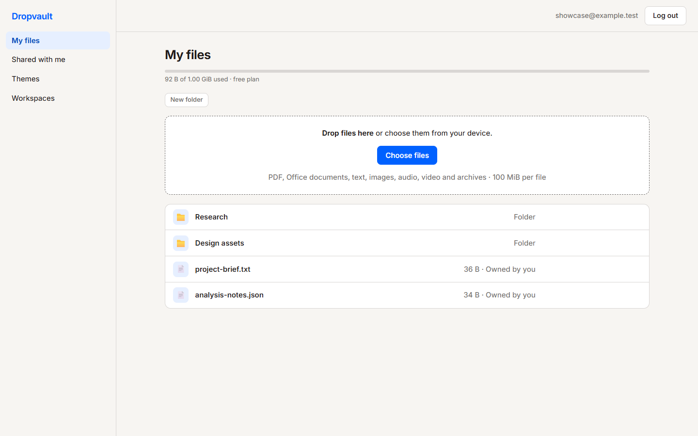
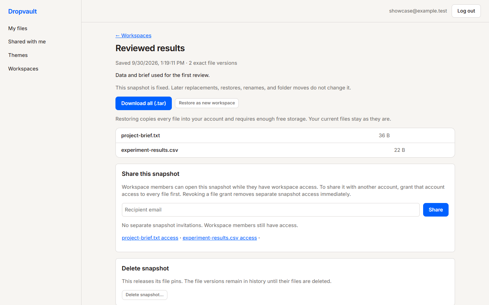

# DropVault

**Keep a project's files, collaborators, and exact milestones together.** DropVault is a two-person, Dropbox-style web app prototype. People can upload documents, data, images, media, and archives; share them with named accounts or temporary links; and collect related files in a workspace. A snapshot records the exact versions used for a milestone, so later edits do not change that record.

The app runs locally today. There is **no public hosted demo** yet; the [local demo](#try-it-locally) takes a few minutes.

## See it

These screenshots were captured from the running app with an isolated fake account and sample files on September 30, 2026. Click an image to view it at full size.

| File browser and upload area | Saved project snapshot |
| --- | --- |
| [](docs/images/files.png) | [](docs/images/snapshot.png) |

[See the workspace screen](docs/images/workspace.png), where an owner adds project files, invites contributors, and creates snapshots.

## What works now

- **Files:** Browse folders, drag and drop multiple files, track each upload, preview browser-supported formats, and download the originals. The API validates the declared type and file structure for selected formats. Supported extensions include PDF, DOCX, PPTX, XLSX, TXT, CSV, JSON, PNG, JPG, GIF, WebP, MP3, MP4, ZIP, and GZ. The default per-file limit is 100 MiB.
- **Ownership and sharing:** Register and sign in; grant a named account access to a file; create and revoke seven-day bearer links; delete owned files; and see used storage against an account limit.
- **Version history:** Upload a replacement, label versions, compare text revisions, preview or download older bytes, and restore an earlier version as a new current revision. Retained versions count toward storage.
- **Project workspaces:** Group selected files, invite viewers or contributors, and save snapshots of exact file versions. Members can download a snapshot as a TAR archive; an authorized account can copy it into a new workspace under its own quota. Import a public GitHub repository as a code ZIP and manually refresh it when new commits arrive, or link a manually uploaded Git archive.
- **Themes:** Browse community themes, install one, customize your saved appearance, and publish a theme with a public creator name.

Workspaces currently list files without a nested folder tree. Snapshots record each selected file's existing folder path, and copying a snapshot recreates those paths in **My files**. GitHub imports are tied to a commit returned by GitHub's API; manually uploaded Git archive labels are uploader supplied and unverified.

## Try it locally

Use Node.js 24. From a fresh checkout, run these from the repository root:

```sh
npm install
npm --prefix apps/web install
npm run seed:demo
```

The seed command prints a generated password for `alex@example.test` and `blair@example.test`. It creates sample file bytes in local storage and refuses to overwrite existing data. Start these in **separate terminals**:

```sh
npm run dev:api
```

```sh
npm run dev:web
```

Open the URL printed by Vite, usually `http://127.0.0.1:5173`. On Windows PowerShell, use `npm.cmd` if `npm` is blocked by the shell's script policy. The [Mac setup guide](docs/mac-frontend-setup.md) gives first-time instructions.

**Five-minute walkthrough:**

1. Sign in as Alex and open **My files**. Preview a sample file, then drop a small TXT or CSV file into the upload area.
2. Open **Workspaces**, create a project, add an owned file, select it, and save a snapshot. Open the snapshot to download its TAR archive or copy it into a new workspace.
3. Return to a file's viewer to inspect version history or create a share link. Sign in as Blair to see the sample file shared with that account.
4. Open **Themes** and install a community theme; sign out and back in to see the saved appearance.

The demo accounts and sample files are for local testing only. The [development guide](docs/local-development.md) covers storage settings, seeding without overwriting data, tests, and troubleshooting.

## How it is built

```text
React + Vite + React Router
          │  /v1 API requests
          ▼
Node.js API ── shared contract in packages/shared
    ├── local mode: JSON catalog + disk file bytes
    └── optional deployment mode: PostgreSQL catalog + private AWS S3 bucket
```

The web and API apps share route helpers, upload types, and limits in [`packages/shared`](packages/shared/index.js). The [API contract](docs/api.md) documents permissions, request and response shapes, storage behavior, and errors. The source lives in [`apps/web`](apps/web) and [`apps/api`](apps/api).

## Project status and limits

| Area | Status |
| --- | --- |
| Web and API flows | Working locally; automated API, web, and browser checks cover key paths. A complete browser check of every flow remains to be built. |
| Storage | Local disk and JSON catalog are the tested development path. S3 and PostgreSQL code and an isolated smoke script exist, but the repository has not recorded a live AWS smoke run or production load test. |
| Upgrades | The unpaid Demo tier switch is a **local-only test flow**. Public billing and entitlement are not implemented. |
| GitHub | Public repository import and manual refresh save a ZIP of the default branch's resolved commit. Private repositories, GitHub sign-in, automatic sync, Git history, and editing or pushing code are not implemented. |
| File recognition ML | A supervised random-forest pilot and content detector were evaluated **offline**. Neither runs in the upload API; [the pilot report](docs/ml/pilot-report.md) explains why it is not ready as a product feature. |

The API has session cookies, ownership checks, per-account quotas, rate limits, and upload validation. These are prototype safeguards; see the [API contract](docs/api.md) for their boundaries. Do not put real credentials or private files in the repository.

## Team

DropVault is a collaboration between [@umerbashir-del](https://github.com/umerbashir-del) (backend, storage, and file-recognition research focus) and [@kerrian-gordon](https://github.com/kerrian-gordon) (frontend and user-experience focus). Product decisions and integration are shared; Git history and pull requests show the individual changes.

## More detail

- [Local setup, configuration, and checks](docs/local-development.md)
- [Manual Git archive and data snapshot walkthrough](docs/git-workspace-walkthrough.md)
- [Public GitHub import and refresh](docs/github-import.md)
- [API, data model, and permissions](docs/api.md)
- [Multi-user MVP plan](docs/multi-user-freemium-mvp.md)
- [Offline file-recognition pilot and results](docs/ml/pilot-report.md)
- [Theme storefront requirements](docs/community-theme-storefront-section-3.md)

To run checks after installing dependencies:

```sh
npm test
npm run build:web
npm --prefix apps/web run test:browser
```

The browser checks use headless Google Chrome and start their own isolated API and web servers.
